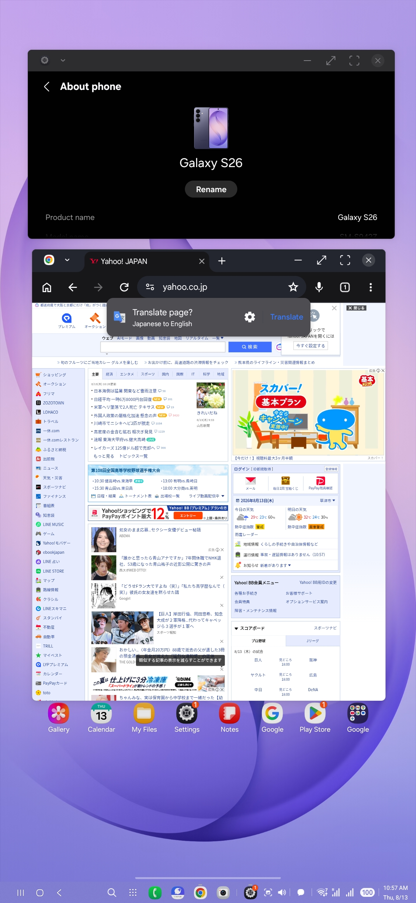
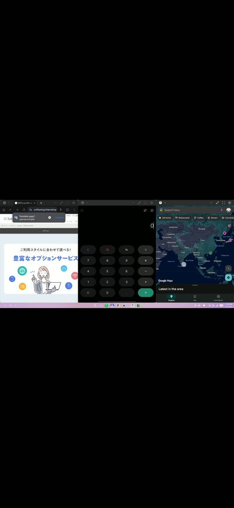

<p align="center">
  
</p>

<h1 align="center">Dextop</h1>

<p align="center">
  <a href="README.md">English</a> | <a href="README.ja.md">日本語</a>
</p>

Dextop is an open-source Android app that creates a virtual display and provides a desktop-like workspace using only a smartphone. It uses Shizuku and Android system services to control app launching, window placement, touch input, orientation, and related desktop behavior.

## Screenshots and demo

<table>
  <tr>
    <td width="20%" align="center"><br><sub>Home and workspaces</sub></td>
    <td width="20%" align="center"><br><sub>Desktop</sub></td>
    <td width="20%" align="center"><br><sub>Control overlay</sub></td>
    <td width="20%" align="center"><br><sub>Multi-window workspace</sub></td>
    <td width="20%" align="center"><a href="docs/media/dextop-demo.mp4"></a><br><sub>▶ Demo video</sub></td>
  </tr>
</table>

## Features

- [x] Virtual displays with configurable resolution, density, and portrait or landscape orientation
- [x] Secure-display and Android system-decoration controls
- [x] Desktop app launcher
- [x] Workspaces that save and restore the placement of multiple apps
- [x] Two-pane, three-pane, four-pane, and other window layouts
- [x] Workspace import and export as JSON
- [x] Cursor and direct-touch input modes
- [x] Tap, long-press, drag, right-click, two-finger, and three-finger gestures
- [x] Automatic resolution switching for foldable open and closed states
- [x] Performance overlay for FPS, refresh rate, memory, battery, and estimated power usage
- [x] Quick Settings tile launch
- [x] Interrupted-session recovery and restoration of temporary Android settings
- [x] Detailed diagnostic reports containing app logs, capability probes, fallback results, and device specifications
- [x] Japanese, English, Chinese, Korean, and Russian interfaces
- [ ] Complete physical-mouse support (currently limited to movement, basic clicks, scrolling, and related input)
- [ ] Complete physical-keyboard support (shortcuts, IMEs, and external-display input routing remain device-dependent)

## Compatibility

| Environment | Status | Notes |
| --- | --- | --- |
| Samsung DeX | Mostly supported | Currently the most complete environment. Features managed by DeX use Samsung's platform implementation. |
| Google Pixel | Limited and incomplete | Depends on Android's freeform/desktop implementation and hidden API availability. Some features may not work. |
| Other Android devices | Experimental | Virtual-display, mirroring, and freeform support varies by manufacturer, model, and OS update. |

Dextop probes device capabilities at runtime and tries compatible backends in order. It still depends on Android hidden APIs and OEM behavior, so results can differ between models and OS versions from the same manufacturer.

<details>
<summary><strong>Supported devices</strong></summary>

The status below applies only to the firmware versions that were actually tested. Open a vendor to see its devices. For build details and feature-by-feature results, see the [Device compatibility wiki](https://github.com/NarYuki/Dextop/wiki/Device-Compatibility).

<details>
<summary><strong>Samsung</strong></summary>

| Device | Model | Tested software | Status |
| --- | --- | --- | --- |
| Galaxy S26 | SM-S942Z (`m1q`) | Android 16 / One UI 8.5 / `S942ZSCS1AZF2` | ✅ Confirmed working |

</details>

<details>
<summary><strong>Google</strong></summary>

No model and firmware combination has been confirmed yet. Pixel support remains limited and incomplete.

</details>

<details>
<summary><strong>Other vendors</strong></summary>

No model and firmware combination has been confirmed yet.

</details>

</details>

## System requirements

- Android 10 or later
- [Shizuku](https://shizuku.rikka.app/)
- Shizuku started through wireless debugging or ADB
- Shizuku permission granted to Dextop

If any part of the Shizuku setup is unclear, follow **Start via wireless debugging** in the [official Shizuku setup guide](https://shizuku.rikka.app/guide/setup/).

## Installation

The Google Play release is currently under review.

Download the latest APK from [GitHub Releases](https://github.com/NarYuki/Dextop/releases/latest) and install it.

## Development

```sh
git clone https://github.com/NarYuki/Dextop.git
cd Dextop
flutter pub get
flutter analyze
flutter test
flutter build apk --debug
```

To contribute support for another device, read [Adding support for a device](docs/ADDING_DEVICE_SUPPORT.en.md). The Japanese guide is [available here](docs/ADDING_DEVICE_SUPPORT.md).

## Diagnostics

Open **Settings → App information → Operation log and device diagnostics** to view, copy, or share device specifications, capability probes, fallback results, and Dextop operation logs. Remove any personal information you do not want to publish before attaching a report to an issue.

This project is under active development. Available features and behavior may change with device firmware and Android updates.

## License

Licensed under GPL-3.0-or-later. See [LICENSE](LICENSE).
